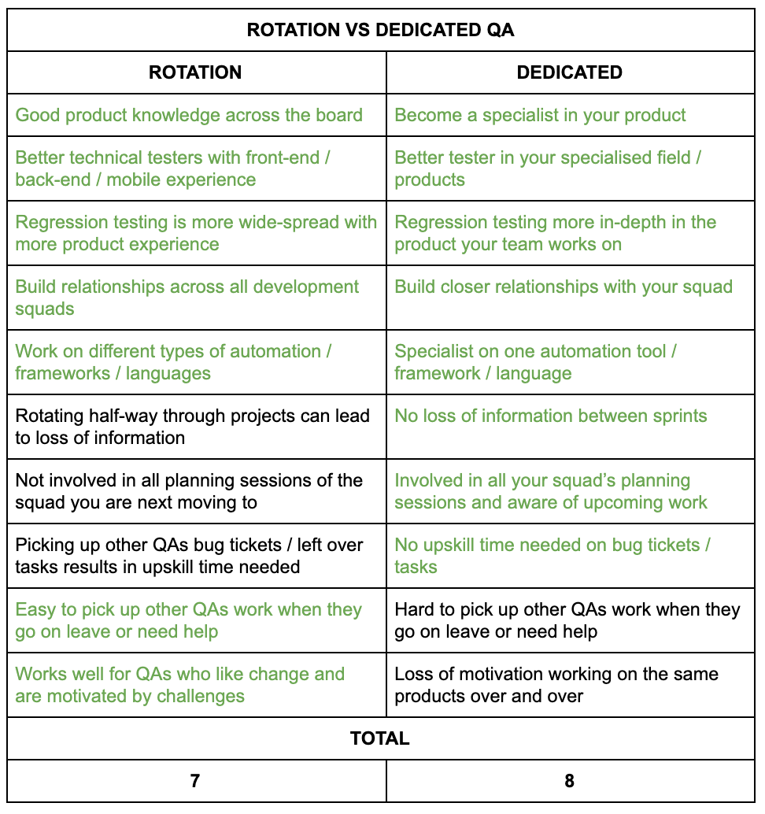

Robbie reviews some of his findings and thoughts around QAs rotating between development squads vs QAs working in one dedicated squad. 

<!-- end -->

Having worked for three software development companies of various sizes, Robbie found that this topic seems to come to light frequently as companies grow. For the purpose of this blog, he will be focusing on his recent experiences at JustPark.

## QA at JustPark

Last year I joined JustPark as a QA. The QA team comprised of three QAs, all self-sufficient with a good mixture of experience and product knowledge. At the time the development team had three squads:

* **Back-end squad** - Working on APIs and legacy systems.
* **Front-end/infrastructure squad** - Working on new products, redesigning the existing platforms and infrastructure.
* **Mobile squad** - Working on the native Android and iOS apps.

The QA team began by rotating between squads every two sprints (four-week cycles). The premise being that all QAs should have good product knowledge across the board, be able to step in and help when someone went on leave or had a heavy workload, and be able to assist with triaging issues raised by customers and business.

During a monthly QA catch up (meeting aimed at revising QA processes) I provided some feedback which led to us iterating the process. The QA team changed rotations to three sprints (six-week cycles) to allow more time with the squad. This was raised because I found two sprints went rather quickly and I wanted to finish projects before rotating, to minimise knowledge loss.

Recently, however, the development and QA team restructured. One of the QAs transitioned into development and two new Junior QAs were recruited. The development team was then restructured into four squads:

* **Back-end squad** - Working on APIs only.
* **Front-end squad** - Working on all front-end products only.
* **Mobile squad** - Working on the native Android and IOS apps as before.
* **Site reliability** - Working on infrastructure and client requests.

The QA team now had four QAs, matching the four development squads. This lead to the decision of having dedicated QAs per squad and to stop QA rotations. The team had many discussions around whether rotations or dedicated QAs was the best solution for the product and personal growth. Here’s what we found.

## Rotation vs Dedicated QA

Below is a comparison of the positives and less favourable aspects that we found between rotations vs dedicated QA methods. Good points are represented in green and result in one point being awarded to the method. The total good points can be seen at the bottom.

## Findings

After weighing up the two methods, it’s clear to see that both have their benefits and drawbacks. A clear theme that runs through the comparison is Specialists vs Generalist, which each have their own unique advantages. So which is the better solution?

The answer: It really comes down to your QA team and can be broken down more into these factors:

* **Team size** - Rotating can be a better solution when the team is small and less able to cope with reductions in personnel (through leave or progression), however, when the engineering team expands (I found from 4 upwards), the team has more resilience and can benefit more from Specialists to Generalists.
* **Team experience levels** - Rotating requires all members to have relatively similar levels of product knowledge and testing skills. A mix of senior and junior QAs can make rotating quite challenging. 
* **New starters** - If you have new starters, rotating can be a great way for them to learn all the products and find their feet. However, they shouldn't take part in the Generalist rotation and should pair with more senior QAs until they've found their feet.
* **Rotation length** - There are many factors that will determine rotation length, such as development methodology (agile, waterfall), length of sprint and size of projects. Rotations should be done on a case by case basis. E.g. Sometimes it makes sense to skip a rotation if the QAs are in the middle of big projects. 
* **Personal touch** - Some QAs really enjoy rotating between squads and products, some prefer staying in their squads. Part of the decision has to be down to the specific people in the QA team. 

## Conclusion

In conclusion, QA rotations and dedicated squads each have their own advantages and disadvantages. The most important takeaway is that you need to find what fits best with your company and QA team. Specialist and Generalist QAs are both assets to any companies.

I personally believe some form of rotation is good. Whether this is just for new starters to get to grips with products, or larger rotations every couple of months. People thrive on career progression and sometimes the best thing for that is change, learning new products and developing your testing skills.
